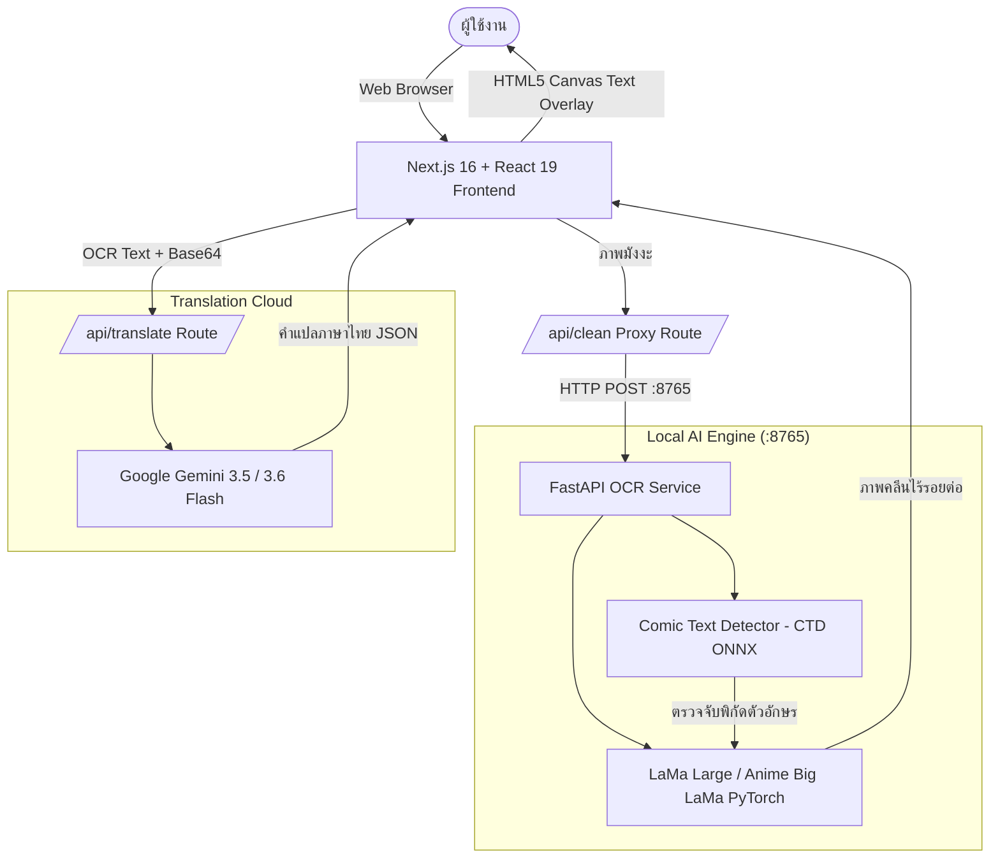

# ⚡ SuperK Manga Translator

ระบบเว็บแอปพลิเคชันสำหรับ **แปลและคลีนมังงะอัตโนมัติ** ผสานพลัง **Local AI Inpainting (ลบตัวหนังสือบนเครื่อง 100% ฟรีและปลอดภัย)** ร่วมกับ **Multi-Model AI Translation (แปลภาษาไทยสละสลวยเป็นธรรมชาติ)** พร้อมเครื่องมือปรับแต่งข้อความและจัดเรียงบอลลูนแบบสตูดิโอมืออาชีพ

---

## 🌟 จุดเด่นของโปรเจกต์ (Key Features)

- 🧹 **Local-First AI Inpainting (ลบข้อความเนียนกริบ ไร้รอยต่อ):**
  - ตรวจจับข้อความมังงะอัตโนมัติด้วย **Comic Text Detector (CTD)**
  - ลบตัวอักษรและซ่อมแซมพื้นหลังด้วยโมเดล **LaMa Large (Anime Big LaMa)** ลบได้ทั้งบอลลูนขาว ลายฉากหลังซับซ้อน ลายเส้นผม และเสื้อผ้า ไม่ต้องต่อเน็ต ไม่เสียค่า API
- 🎨 **Smart Text Color & Stroke Matcher 2.0:**
  - ระบบดูดสีตัวอักษรและขอบเส้นอัจฉริยะ (เช่น ข้อความสีขาวขอบแดง, ตัวอักษรสีสดบนฉากแอ็กชัน) โดยไม่หลุดไปดูดสีผิวตัวละครหรือสีฉากหลัง
- 🌐 **Multi-Model AI Translation Hub:**
  - รองรับ Google Gemini API ล่าสุด (`gemini-3.5-flash-lite`, `gemini-3.6-flash`)
  - แปลบทสนทนาเป็นภาษาไทยที่ลื่นไหล เป็นธรรมชาติ เข้ากับบริบทมังงะ
  - ระบบ **Multi-API Key Rotation** สลับคีย์อัตโนมัติเมื่อชนขีดจำกัดโควต้า (429 Rate Limit)
- 🛠️ **Full Editing Studio:**
  - สลับดูภาพได้ 3 โหมดทันที: **Original (ต้นฉบับ)**, **Clean (ภาพคลีน)**, **Translated (ภาพแปลเสร็จ)**
  - คลิกแก้ไขข้อความ ปรับขนาด ย้ายตำแหน่งบอลลูน หมุนองศา และเปลี่ยนฟอนต์ได้อิสระ
  - มีเครื่องมือพ่น Mask ซ่อมแซมและกู้คืนลายเส้นเฉพาะจุด
- 📦 **All-in-One Format Support:**
  - รองรับไฟล์รูปภาพ (`PNG`, `JPG`, `WEBP`)
  - รองรับไฟล์รวมเล่ม (`ZIP`, `CBZ`, `PDF`) ลากวางแล้วอ่านแปลได้ทั้งตอน
  - ส่งออกผลงาน (Export) เป็นรูปภาพเดี่ยว หรือรวมทั้งเล่มเป็น `ZIP`, `CBZ`, `PDF`

---

## 🖥️ ความต้องการของระบบ (System Requirements)

| รายการ | ความต้องการขั้นต่ำ | แนะนำสำหรับใช้งาน |
| :--- | :--- | :--- |
| **ระบบปฏิบัติการ** | Windows 10/11 (64-bit), Linux, macOS | Windows 11 (64-bit) |
| **Node.js** | v20.x หรือ v22.x LTS | **Node.js v22 LTS** |
| **Python** | Python 3.10 หรือ 3.11 (64-bit) | **Python 3.11.x (64-bit)** |
| **RAM** | 8 GB | **16 GB ขึ้นไป** |
| **พื้นที่ว่างบนดิสก์** | ~3 GB (สำหรับ Dependencies และโมเดล AI) | SSD ความเร็วสูง |
| **การ์ดจอ (GPU)** | ไม่จำเป็น (ทำงานบน CPU ได้ 100%) | NVIDIA GPU (รองรับ CUDA เพื่อความเร็วสูงขึ้น) |
| **API Key สำหรับการแปล** | Google Gemini API Key (ฟรี) | คีย์จาก [Google AI Studio](https://aistudio.google.com/) |

---

## 🚀 ขั้นตอนการติดตั้งอย่างละเอียด (Step-by-Step Installation)

### ขั้นตอนที่ 1: ดาวน์โหลด Source Code (Clone Repository)

เปิด **PowerShell** หรือ **Terminal** แล้วรันคำสั่ง:

```powershell
git clone https://github.com/krgame00/SuperK.git
cd SuperK
```

---

### ขั้นตอนที่ 2: ติดตั้งและตั้งค่า Backend (Python Inpainting Service)

Service นี้ทำหน้าที่ตรวจจับตัวหนังสือและลบภาพด้วยโมเดล AI บนเครื่องของคุณ

1. **เข้าโฟลเดอร์ `ocr-service` และสร้าง Virtual Environment:**
   ```powershell
   cd ocr-service
   py -3.11 -m venv venv
   ```

2. **เปิดใช้งาน venv และติดตั้ง Dependencies:**
   ```powershell
   .\venv\Scripts\Activate.ps1
   python -m pip install --upgrade pip
   pip install -r requirements.in
   ```
   > *หมายเหตุ:* หากต้องการรันผ่าน CPU ให้ติดตั้ง PyTorch รุ่น CPU น้ำหนักเบาด้วยคำสั่ง:
   > ```powershell
   > pip install torch torchvision --index-url https://download.pytorch.org/whl/cpu
   > ```

3. **ดาวน์โหลดโมเดล AI (Detection + LaMa Large Inpainting):**
   รันคำสั่งดาวน์โหลดโมเดลทั้งหมดลงในโฟลเดอร์ `ocr-service/models/` โดยอัตโนมัติ:
   ```powershell
   python scripts/install_models.py --all
   ```
   *(ระบบจะดาวน์โหลดโมเดล Comic Text Detector และ LaMa Large พร้อมตรวจสอบความถูกต้องของ SHA-256 Checksum)*

4. **กลับมาที่โฟลเดอร์หลักของโปรเจกต์:**
   ```powershell
   cd ..
   ```

---

### ขั้นตอนที่ 3: ติดตั้งและตั้งค่า Frontend (Next.js Web Interface)

1. **ติดตั้ง Node Packages:**
   ```powershell
   npm install
   ```

2. **ตั้งค่า Gemini API Key สำหรับการแปลภาษา:**
   สร้างไฟล์ชื่อ `.env.local` ในโฟลเดอร์หลักของโปรเจกต์ (หรือคัดลอกจาก `.env.example` หากมี):
   ```env
   GEMINI_API_KEY=AIzaSyYourGeminiApiKeyHere
   ```
   > 💡 **Tip:** สามารถใส่หลายคีย์คั่นด้วยเครื่องหมายจุลภาค (`,`) เพื่อเปิดระบบ Auto-Key Rotation เช่น:
   > `GEMINI_API_KEY=AIzaSyKey1...,AIzaSyKey2...,AIzaSyKey3...`

---

## 🎯 วิธีเปิดใช้งานระบบ (How to Run)

การเปิดใช้งานจะรัน **2 หน้าต่าง Terminal (PowerShell)**:

### 1. หน้าต่างที่ 1: รัน Backend OCR & Cleaner Service
```powershell
.\ocr-service\run.ps1
```
- ระบบจะเปิด Service ขึ้นมาที่ `http://127.0.0.1:8765` พร้อมโหลดโมเดล Inpainting

### 2. หน้าต่างที่ 2: รัน Frontend Web App
```powershell
npm run dev
```
- ระบบจะเปิดหน้าเว็บขึ้นมาที่ `http://localhost:3000`

---

## 📖 คู่มือการใช้งานเบื้องต้น (Usage Guide)

1. **เปิดเบราว์เซอร์:** เข้าไปที่ [http://localhost:3000](http://localhost:3000)
2. **นำเข้ามังงะ (Import):**
   - ลากไฟล์ภาพ (`PNG`, `JPG`, `WEBP`) หรือไฟล์รวมเล่ม (`ZIP`, `CBZ`, `PDF`) มาวางลงบนหน้าต่างเว็บ
3. **การคลีนลบตัวหนังสือ (Clean):**
   - กดปุ่ม **"คลีนหน้าปัจจุบัน"** เพื่อลบตัวหนังสือหน้านั้น หรือกด **"คลีนทั้งเล่ม"** เพื่อลบทีละหน้าแบบอัตโนมัติ
   - สลับแถบดูความเนียนได้ระหว่าง `Original` (ต้นฉบับ), `Clean` (ภาพคลีน), และ `Mask` (จุดที่ลบ)
4. **การแปลภาษา (Translate):**
   - กดปุ่ม **"แปลหน้าปัจจุบัน"** หรือ **"แปลทั้งเล่ม"**
   - ระบบจะตรวจจับข้อความ สกัดสไตล์สี และวางข้อความภาษาไทยลงบนภาพแบบเรียลไทม์
5. **การแก้ไขบอลลูน (Manual Tuning):**
   - **คลิกที่บอลลูนข้อความ:** เพื่อพิมพ์แก้ไขคำแปล, ย้ายตำแหน่ง, ปรับขนาดกล่อง, หรือหมุนองศา
   - **แถบเครื่องมือด้านข้าง:** ปรับเปลี่ยนฟอนต์ (เช่น ฟอนต์ *Itim*, *Chakra Petch*), ปรับสีตัวอักษร, ขนาดขอบเส้น
6. **การส่งออกผลงาน (Export):**
   - กดปุ่ม **"Export"** ที่มุมขวาบน เลือกดาวน์โหลดเป็นรูปภาพเดี่ยว หรือรวมทั้งเล่มเป็นไฟล์ `ZIP`, `CBZ` หรือ `PDF`

---

## 🏗️ สถาปัตยกรรมเทคโนโลยี (Tech Stack Architecture)



---

## 🧪 การรันชุดทดสอบ (Running Test Suites)

คุณสามารถตรวจสอบความถูกต้องของระบบทั้งฝั่ง Frontend และ Backend ได้ด้วยคำสั่ง:

```powershell
# ตรวจสอบความถูกต้องและรันเทสต์ฝั่ง Backend (107+ tests)
cd ocr-service
.\venv\Scripts\ruff check app scripts tests
.\venv\Scripts\pytest tests -v
cd ..

# ตรวจสอบ Type, Lint และรันเทสต์ฝั่ง Frontend (270+ tests)
npx tsc --noEmit
npm run lint
npm test
```

---

## ❓ ปัญหาที่พบบ่อยและการแก้ไข (Troubleshooting)

### 1. หน้าเว็บขึ้นแจ้งเตือนว่า "ไม่สามารถเชื่อมต่อ Local Cleaning Service ได้"
- ตรวจสอบว่าในหน้าต่าง Terminal ที่ 1 ได้รัน `.\ocr-service\run.ps1` ไว้แล้วหรือไม่
- ตรวจสอบว่าพอร์ต `8765` ไม่ได้ถูกโปรแกรมอื่นใช้งานอยู่

### 2. เกิดข้อผิดพลาด 429 Quota Exceeded ขณะแปลภาษา
- เกิดจากการใช้ Gemini API เกินโควต้าความถี่ (RPM/RPD) ของคีย์ฟรี
- **วิธีแก้:** เปิดการตั้งค่า (Settings) บนหน้าเว็บ แล้วเพิ่ม API Key สำรองเข้าไปหลายๆ คีย์ โดยคั่นด้วยเครื่องหมายจุลภาค (`,`) ระบบจะสลับคีย์ใช้งานให้อัตโนมัติ

### 3. บน Windows รันสคริปต์ PowerShell ไม่ได้ ติด ExecutionPolicy
- เปิด PowerShell ด้วยสิทธิ์ Administrator แล้วพิมพ์คำสั่ง:
  ```powershell
  Set-ExecutionPolicy -ExecutionPolicy RemoteSigned -Scope CurrentUser
  ```

---

## 📄 ใบอนุญาต (License)

- Source code ในโปรเจกต์นี้เผยแพร่ภายใต้ **MIT License**
- โมเดล AI ต่างๆ มีใบอนุญาตการใช้งานเฉพาะของแต่ละโมเดล (โปรดอ่านรายละเอียดเพิ่มเติมใน [ocr-service/THIRD_PARTY_MODELS.md](file:///C:/Users/PC/Downloads/manga-translator/ocr-service/THIRD_PARTY_MODELS.md))
