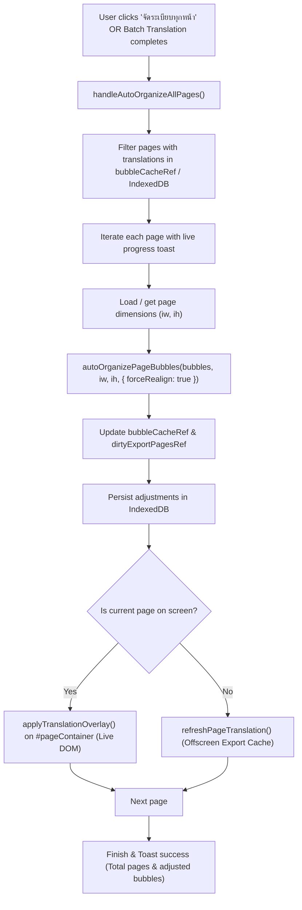

# Design Spec: Batch Auto-Organize All Pages ("จัดระเบียบทุกหน้า ออโต้ทั้งเล่ม")

**Date:** 2026-10-10  
**Status:** Approved by User  
**Component:** SuperK Workspace (`src/app/page.tsx`, `components/workspace/WorkspaceAdvancedTools.tsx`, `lib/bubbleLayoutOptimizer.ts`)

---

## 1. Objective

Provide a seamless, one-click mechanism to automatically organize text bubbles across all pages in the manga ("จัดระเบียบทุกหน้า"):
1. Adapts narrow vertical Japanese OCR bounding boxes into comfortable manga speech balloon proportions (130px–180px).
2. Enlarges Thai text to readable manga font sizes (16px–24px).
3. Resolves multi-bubble collisions (de-overlap) so adjacent dialogue balloons cleanly separate.
4. Updates both interactive screen overlays and offscreen export caches with IndexedDB persistence.
5. Runs automatically upon completing batch translation ("แปลทั้งเล่ม").

---

## 2. User Entry Points (UI & Access)

### 2.1 CleaningToolbar (Translated Layer)
- Transform `[ 🪄 จัดระเบียบ ]` into an accessible dropdown/split action:
  - **Clicking action button**: Directly triggers "จัดระเบียบหน้านี้" (fast single-page workflow).
  - **Dropdown arrow `⌄`**: Opens a lightweight menu with:
    1. `🪄 จัดระเบียบหน้านี้` (Current Page)
    2. `✨ จัดระเบียบทุกหน้า ({count} หน้า)` (All Pages)
  - Designed with responsive single-row height (`h-7 sm:h-7.5`) to prevent toolbar line wrapping on any screen size.

### 2.2 WorkspaceAdvancedTools (เมนู "เครื่องมือ")
- Add a new menu item:
  - **Label:** `🪄 จัดระเบียบคำแปลทุกหน้า`
  - **Icon:** `<Sparkles className="h-4 w-4 text-primary" />`
  - **State:** Disabled when `operationBusy` or when 0 pages have translations.

### 2.3 Post-Batch Translation Integration (`handleTranslateAll`)
- In `handleTranslateAll`, once all pages have completed translation, automatically execute `autoOrganizeAllPages()` in the background before showing the final success message.

---

## 3. Architecture & Data Flow

---

## 4. Performance & Reliability Safeguards

1. **Non-blocking Execution:** Uses async loop with microtasks (`await new Promise(r => setTimeout(r, 0))`) to keep browser responsive.
2. **Dimension Resolution:**
   - Active page: reads from `#pageContainer img` directly.
   - Inactive pages: uses cached dimensions or fast image pre-probe (caching `Map<string, {width, height}>`), falling back safely to default 1200x1800 if network fails.
3. **Zero Data Loss:** Preserves all user edits, deleted bubble markers, and manual translations. Only adjusts `layoutAdjustment` and `targetFontSize`.
4. **Idempotency:** Re-running multiple times produces consistent, non-divergent results.

---

## 5. Verification Plan

1. **Unit Tests (`tests/unit/bubbleLayoutOptimizer.test.ts`):**
   - Verify multi-page layout organization helper functions.
2. **Workspace Integration Tests (`tests/workflow/WorkspacePage.test.tsx`):**
   - Verify clicking "จัดระเบียบทุกหน้า" iterates across pages and updates `bubbleCacheRef`.
   - Verify toolbar dropdown renders and triggers single vs all-pages actions.
3. **Live System Verification:**
   - Test on user's 21-page PDF (`E:\SuperK\SuperK_Translations (137).pdf`).
   - Confirm all pages with collisions and narrow text expand to legible sizes without overlap.
